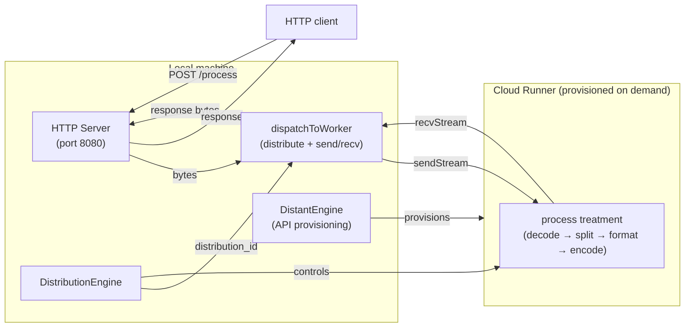

# Distributed Work

An HTTP server that dispatches each incoming request body to a remote cloud worker for processing. The worker prefixes every line with `[WORKER]` and streams the result back. The cloud runner is provisioned on demand by `DistantEngine`; no second process needs to be started manually.

## What it does

- On startup, provisions a cloud runner via the Mélodium Services API.
- Once the runner is live, connects a `DistributionEngine` to it and starts the HTTP server.
- Every `POST /process` request body is sent to the remote `process` treatment on the worker node.
- The worker decodes the bytes, splits on newlines, prepends `[WORKER] ` to each line, and streams the bytes back.
- The transformed bytes are returned as the HTTP response.

```
melodium run Compo.toml -- \
  --api_token "my-api-token" \
  --port 8080

curl -X POST http://127.0.0.1:8080/process \
     -H "Content-Type: text/plain" \
     -d "hello world"
# → [WORKER] hello world
```

## How it is built

### Models

| Model | Type | Purpose |
|---|---|---|
| `runner` | `DistantEngine` | Provisions cloud runner via Mélodium Services API |
| `distributor` | `DistributionEngine` | Routes work to `distributed_work/worker::process` |
| `server` | `HttpServer` | HTTP listener on localhost |

### Source files

| File | Contents |
|---|---|
| `main.mel` | Entry point, HTTP server, dispatch treatment |
| `worker.mel` | `process` treatment executed remotely; `runWorker` standalone entrypoint |

### Treatments

**`main`** is the entry point. It provisions the runner, connects the distributor, starts the HTTP server, and wires connections to `dispatchToWorker`.

**`dispatchToWorker[distributor]`** is the per-request bridge:
1. `trigger<byte>()` fires when the first request byte arrives.
2. `distribute` creates a distribution slot and emits a `distribution_id`.
3. `sendStream<byte>` forwards the request bytes to the remote worker under that ID.
4. `recvStream<byte>` collects the response bytes from the same ID and forwards them as output.

**`process`** (in `worker.mel`) runs remotely:
1. Decodes bytes to UTF-8 text.
2. Splits on newlines.
3. Flattens the `Vec<string>` into individual strings.
4. Wraps each line in a `StringMap` entry and formats it with `"[WORKER] {line}"`.
5. Encodes back to bytes.

## Distribution architecture



## Runtime behaviour

1. **Startup**: `DistantEngine` contacts `https://api.melodium.tech/0.1` and provisions a runner with 256 MB RAM, 0.5 CPU, 256 MB storage. The runner receives the packaged program and starts `distributed_work/worker::process`.

2. **Distribution connect**: When `distant` emits `access`, it is forwarded to `distribStart.access`. The `DistributionEngine` connects to the runner and emits `ready` when the channel is established. The HTTP server starts only after this `ready` signal.

3. **Per-request dispatch**: For each `POST /process`:
   - `bodyTrigger` fires on the first byte; status 200 and headers are sent immediately.
   - `distribute` allocates a distribution slot with a unique `distribution_id`.
   - `sendStream<byte>` tunnels the raw request bytes to the remote `process` treatment.
   - The remote treatment processes them and sends results back.
   - `recvStream<byte>` receives the result bytes and forwards them to `connection.data`.

4. **Concurrency**: Multiple simultaneous requests each get their own track with their own `distribute` call and `distribution_id`. The distribution engine handles multiplexing.

### Key Mélodium patterns used

- **`DistantEngine` + `DistributionEngine`**: separation of concerns: `DistantEngine` handles infrastructure (provisioning, networking), `DistributionEngine` handles work routing (distribution IDs, send/recv channels).
- **`|wrap<string>(...)`**: `DistantEngine`'s `api_url` and `api_token` params are `Option<string>`; `|wrap<string>` promotes a plain string to `Some(string)`.
- **`distribStart.ready` as HTTP gate**: the HTTP server only starts listening after the distributor confirms the remote worker is reachable, preventing requests from arriving before the worker is ready.
- **Named streams**: `sendStream<byte>(name="data")` and `recvStream<byte>(name="data")` use the same name `"data"` to match the `process` treatment's input and output port names.
