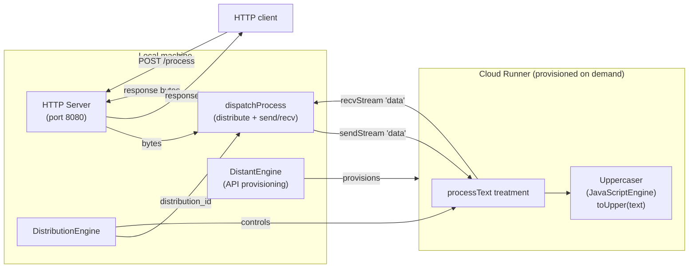

# Distributed Text Processing

An HTTP server that uppercases every character of incoming text using a JavaScript engine running on a cloud worker provisioned on demand. The `DistantEngine` provisions the runner automatically; the `DistributionEngine` routes each request's bytes to the remote `processText` treatment and streams the result back.

## What it does

- Provisions a cloud runner via the Mélodium Services API on startup.
- Starts an HTTP server once the runner is connected.
- Every `POST /process` request body (plain text) is sent to the remote worker.
- The worker uppercases every character using an embedded JavaScript function.
- The uppercased bytes stream back as the HTTP response.

```
melodium run Compo.toml -- \
  --api_token "my-api-token" \
  --port 8080

curl -X POST http://127.0.0.1:8080/process \
     -H "Content-Type: text/plain" \
     -d "hello world from melodium"
# → HELLO WORLD FROM MELODIUM
```

## How it is built

### Models

| Model | Type | Purpose |
|---|---|---|
| `runner` | `DistantEngine` | Provisions cloud runner via Mélodium Services API |
| `distributor` | `DistributionEngine` | Routes work to `distributed_text_processing/main::processText` |
| `server` | `HttpServer` | HTTP listener on localhost |
| `Uppercaser` | `JavaScriptEngine` | JS function `toUpper(text)` — used on the remote side |

### Treatments

**`main`** — Entry point. Provisions the runner, connects the distributor, starts the HTTP server, wires connections to `dispatchProcess`.

**`dispatchProcess[distributor]`** — Per-request bridge. Uses `distribute` to get a `distribution_id`, then `sendStream<byte>` to push request bytes to the remote worker and `recvStream<byte>` to collect and return the result bytes.

**`processText`** — Executes remotely:
1. `decode` — bytes to UTF-8 strings.
2. `fromString<string>` — wraps each string in a `Json` value for the JS engine.
3. `process[uppercaser]` — calls `toUpper(value)` via the embedded JS engine.
4. `unwrapOr<Json>` + `tryToString<Json>` + `unwrapOr<string>` — extracts the uppercased string, falling back to `""` on error.
5. `encode` — converts the uppercased string back to bytes.

## Distribution architecture



## Runtime behaviour

1. **Startup**: `DistantEngine` provisions a runner (256 MB RAM, 0.5 CPU, 256 MB storage). The `Uppercaser` model (and the `processText` treatment) run on this remote node.

2. **Distribution connect**: `distant.access` is forwarded to `distribStart.access`. Once the `DistributionEngine` connects to the runner, `distribStart.ready` fires. The HTTP server starts only at this point — no requests can be accepted before the worker is live.

3. **Per-request processing**:
   - A new track is created for each connection.
   - `bodyTrigger.start` gates the status and headers (200 OK sent immediately).
   - `dispatchProcess` calls `distribute`, obtains a `distribution_id`, sends bytes via `sendStream`, and awaits the result on `recvStream`.
   - On the runner, `processText` receives the bytes, runs the JS uppercasing pipeline, and streams the result back.

4. **JS type chain on the remote side**: The `process` treatment in the `javascript` package works with `Json` values. `fromString<string>` wraps the plain string as a `Json` string value; after JS processing, `tryToString<Json>` extracts the string from the result JSON; `unwrapOr<string>` provides a safe fallback.

### Key Mélodium patterns used

- **`Uppercaser` as a model on the remote side** — the JavaScript engine is instantiated once on the cloud runner and shared across all distribution requests routed to that runner.
- **`fromString<string>` → `process` → `tryToString<Json>`** — the standard bridge pattern for feeding plain strings through the `JavaScriptEngine.process` treatment, which operates on `Json` values.
- **Named streams matching port names** — `sendStream<byte>(name="data")` and `recvStream<byte>(name="data")` use `"data"` to match `processText`'s `input data` and `output data` port names.
- **`distribStart.ready` as server gate** — prevents the HTTP server from accepting connections before the remote worker is ready.
