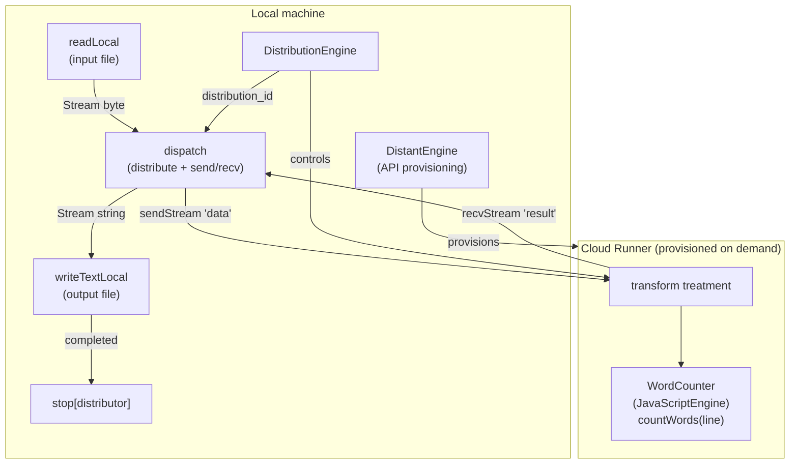

# Cloud Worker Pipeline

A CLI program that reads a local text file, sends it to a cloud runner for word-count processing, and writes the results locally. The cloud runner is provisioned on demand via `DistantEngine` and released when the pipeline completes. The remote processing uses an embedded JavaScript engine to count words per line.

## What it does

1. Provisions a cloud runner with a container image (`ubuntu:jammy`).
2. Connects a `DistributionEngine` to the runner once it is live.
3. Reads a local input file and streams the bytes to the remote `transform` treatment.
4. The remote treatment decodes UTF-8, counts words per line using JavaScript, and streams word counts back as strings.
5. Results are written to a local output file.
6. The distributor is stopped (releasing the cloud runner) after writing completes.

```
melodium run Compo.toml -- \
  --api_token "my-api-token" \
  --input     data.txt \
  --output    word_counts.txt
```

## How it is built

### Models

| Model | Type | Purpose |
|---|---|---|
| `runner` | `DistantEngine` | Provisions cloud runner via Mélodium Services API |
| `distributor` | `DistributionEngine` | Routes work to `cloud_worker_pipeline/main::transform` |
| `WordCounter` | `JavaScriptEngine` | JS function `countWords(line)` instantiated on the remote runner |

### Source file

Everything is in `main.mel`: the entry point, the dispatch bridge treatment, and the remote `transform` treatment (referenced by name in the `DistributionEngine` model).

### Treatments

**`main`** is the entry point:
1. Provisions the runner.
2. Connects the distributor.
3. Reads the input file once the distributor is ready.
4. Dispatches the byte stream to the remote worker via `dispatch`.
5. Writes result strings locally.
6. Stops the distributor when writing completes.

**`dispatch[distributor]`** is the bridge treatment:
- `trigger<byte>()` fires when the first input byte arrives.
- `distribute` allocates a distribution slot (`distribution_id`).
- `sendStream<byte>(name="data")` tunnels the input bytes to the remote `transform`.
- `recvStream<string>(name="result")` collects the per-line word counts.

**`transform`** executes remotely:
1. `decode` converts bytes to UTF-8 strings.
2. `fromString<string>` wraps each string as a `Json` value.
3. `process[counter]` calls `countWords(value)` in the JS engine.
4. `unwrapOr<Json>` + `tryToString<Json>` + `unwrapOr<string>` extract the count string, defaulting to `"0"`.
5. Output is `result: Stream<string>`.

The `countWords` JavaScript function trims whitespace, returns `"0"` for blank lines, and otherwise returns the number of space-separated tokens as a string.

## Distribution architecture



## Runtime behaviour

1. **Runner provisioning**: `DistantEngine` contacts `https://api.melodium.tech/0.1` with the API token, requesting a runner with 512 MB RAM, 1 CPU, 1 GB storage. The runner receives the packaged program; the Mélodium runtime on the runner natively handles `JavaScriptEngine` without any additional container or system dependency.

2. **Distribution connect**: `provisionRunner.access` flows to `distribStart.access`. The `DistributionEngine` connects to the runner and emits `ready`. `logProvisioned` fires at this point.

3. **File reading**: `read.trigger` fires when `distribStart.ready` fires: the input file is read only after the runner is confirmed live. `read.data` (a `Stream<byte>`) flows directly into `dispatch.data`.

4. **Remote processing**: `dispatch` calls `distribute` to get a `distribution_id`, then simultaneously tunnels:
   - The input bytes to `transform.data` via `sendStream<byte>(name="data")`.
   - Receives `transform.result` via `recvStream<string>(name="result")`.

   On the runner, `transform` decodes lines, counts words via JavaScript, and streams count strings back.

5. **Local write**: Result strings stream into `writeTextLocal`. When writing completes (`completed`), `distribStop.trigger` fires: the distributor sends a stop signal to the runner, releasing the cloud resource. `logDone` fires concurrently.

6. **Cleanup**: The runner is provisioned for at most 600 seconds (`max_duration`); `stop` releases it early when the pipeline finishes.

### Key Mélodium patterns used

- **`stop[distributor]` for resource cleanup**: explicitly stops the distribution engine (and releases the cloud runner) after work completes. Without this, the runner would run until `max_duration` expires.
- **Different send/recv types**: input bytes (`Stream<byte>`) are sent to the remote treatment, but results come back as strings (`Stream<string>`). The `name` parameter must match the remote treatment's port name exactly.
- **`distribStart.ready` as file-read gate**: the local file is read only after the remote worker is confirmed ready, avoiding sending data into a closed channel.
- **`JavaScriptEngine` on the runner**: the Mélodium runtime natively supports `JavaScriptEngine`; no special container image or system dependency is needed on the remote node.
