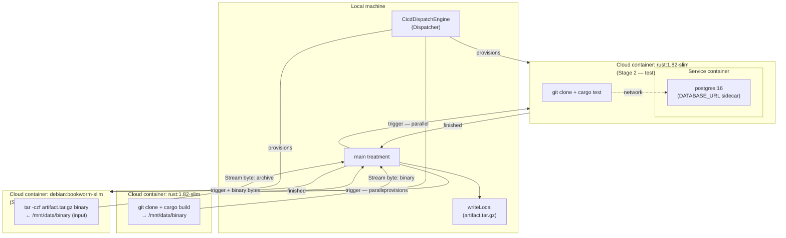

# CI Pipeline

A three-stage CI pipeline that provisions cloud containers on demand, runs a full build-test-package workflow, and streams the resulting artifact back to the local machine. Demonstrates the `cicd` package's high-level `simpleStep` and `simpleStepWithInput` treatments, including a service container sidecar (PostgreSQL) for integration tests.

## What it does

1. **Stage 1 — build** (concurrent): provisions a `rust:1.82-slim` container, clones the repo, runs `cargo build --release`, streams the binary back.
2. **Stage 2 — test** (concurrent with stage 1): provisions a `rust:1.82-slim` container **with a `postgres:16` service container** as a network sidecar, clones the repo, runs `cargo test` with `DATABASE_URL` pointing at the Postgres sidecar.
3. Waits for both stages to finish.
4. **Stage 3 — package**: provisions a `debian:bookworm-slim` container, receives the binary from stage 1 as input, bundles it into a `tar.gz` archive, streams it back.
5. Writes the archive locally.

Stages 1 and 2 run in parallel. Stage 3 starts only after both complete.

```
melodium run Compo.toml -- \
  --api_token "my-api-token" \
  --repo_url  "https://github.com/my-org/my-project.git"
```

## How it is built

### Models

| Model | Type | Purpose |
|---|---|---|
| `Dispatcher` | `CicdDispatchEngine` | Contacts the Mélodium Services API to provision containers |

`CicdDispatchEngine` wraps `DistantEngine` and `DistributionEngine` into a single high-level model. Each `simpleStep` call internally handles runner provisioning, command execution, and optional file extraction, then stops the runner on completion.

### Treatments

**`main`** — Entry point. Fires both `build` and `test` from `startup.trigger` (parallel). Chains two `one<void>` instances to merge four error/failure signals into a single abort log. Uses `flock<void>` to wait for both stages to finish, then `trigger<void>()` to convert the resulting `Stream<void>` to a `Block<void>` gate for `package`.

**`build[dispatcher]`** — Thin wrapper around `simpleStep`. Runs four shell commands in `rust:1.82-slim`: installs git, clones the repo, compiles, copies the binary to `/mnt/data/binary`. The `out_file = "binary"` parameter causes `simpleStep` to extract and stream that file back as `data: Stream<byte>`.

**`test[dispatcher]`** — Thin wrapper around `simpleStep`. Same container image as `build`, but adds a `postgres:16` **service container** with environment variables `POSTGRES_USER`, `POSTGRES_PASSWORD`, `POSTGRES_DB`. The `DATABASE_URL` variable in the main container points at `postgres://ci:ci@postgres/ci_test`. No `out_file` — only success/failure matters.

**`package[dispatcher]`** — Thin wrapper around `simpleStepWithInput`. Receives the binary bytes as `data: Stream<byte>` (from `build.data`), writes them to `/mnt/data/binary` on a `debian:bookworm-slim` container (`in_file = "binary"`), then runs `tar` to archive it. The archive is extracted via `out_file = "artifact.tar.gz"` and streamed back.

### Source file layout

Everything is in `main.mel` — the three stage treatments are local wrappers, keeping the file self-contained.

## Distribution architecture



## Runtime behaviour

1. `startup` fires; `logStart` logs; `build` and `test` are triggered simultaneously — two separate container provisioning requests go out concurrently.

2. **Stage 1** (`build`):
   - `CicdDispatchEngine` provisions a `rust:1.82-slim` container with 2 CPU cores, 4 GB RAM, 8 GB storage.
   - The four shell commands run sequentially inside the container.
   - When the final command copies the binary to `/mnt/data/binary`, `simpleStep` detects `out_file = "binary"` and streams its bytes back as `data: Stream<byte>`.
   - `finished` fires when the container is stopped.

3. **Stage 2** (`test`):
   - A `rust:1.82-slim` container is provisioned, alongside a `postgres:16` **service container**.
   - The service container receives `POSTGRES_USER`, `POSTGRES_PASSWORD`, `POSTGRES_DB` as environment variables and is reachable from the main container under the hostname `"postgres"`.
   - `cargo test` runs with `DATABASE_URL=postgres://ci:ci@postgres/ci_test`.
   - No output file — only `success` / `error` matter.
   - `finished` fires when the container is stopped.

4. `flock<void>()` waits until both `build.finished` and `test.finished` have fired. Its output is `Stream<void>`; `trigger<void>()` converts it to a `Block<void>` start signal for `package`.

5. **Stage 3** (`package`):
   - Triggered by `bothTrigger.start`; receives the binary byte stream from `build.data`.
   - `simpleStepWithInput` writes the bytes to `/mnt/data/binary` on the container (`in_file = "binary"`), then runs `tar`.
   - The resulting archive is extracted via `out_file = "artifact.tar.gz"` and streamed back as `data`.

6. `writeLocal` writes the archive bytes to the local `--output` path. `logDone` fires on completion.

7. If any stage fails or exits with a non-zero code, `one<void>` chains merge the signals into a single `logAbort` message. The `package` stage still starts (it gates on `flock` not on success), but will receive no binary data if `build` failed — `simpleStepWithInput` will error when it tries to extract the missing `in_file`.

### Key Mélodium patterns used

- **`simpleStep` / `simpleStepWithInput`** — the `cicd` package's high-level API: one treatment call handles container provisioning, command execution, optional file input/output, and cleanup. No `DistantEngine` or `DistributionEngine` wiring needed.
- **`service_container`** — a sidecar container (`postgres:16`) running alongside the main container, reachable by hostname. Environment variables configure the database; `DATABASE_URL` in the main container points at it.
- **`|wrap<StringMap>(...)`** — `simpleStep`'s `variables` and `|service_container`'s `env` parameters are `Option<StringMap>`; `|wrap<StringMap>` promotes a plain `StringMap`.
- **Parallel stages with `flock`** — `flock<void>()` collects two `finished` signals (one per stage) and emits a stream element when both have arrived, enabling a fork-join pattern without explicit synchronisation code.
- **`trigger<void>()`** — converts `Stream<void>` (from `flock.stream`) to a `Block<void>` start signal, bridging the stream-to-block boundary needed for `package.trigger`.
- **Binary pipe between stages** — `build.data: Stream<byte>` is connected directly to `package.data: Stream<byte>`, so the binary bytes flow from the build container to the package container without being buffered on disk locally.
